```mermaid
flowchart LR

  subgraph Source
    gs["Google Sheets CRM Export (CSV)"]
  end

  subgraph Ingestion
    airbyte["Airbyte (Manual UI sync due to trial limits)"]
  end

  subgraph Snowflake
    raw["Snowflake RAW schema"]
    stg["Snowflake STG schema"]
  end

  subgraph dbt
    dbt_stg["dbt staging models"]
    dbt_int["dbt intermediate models"]
    dbt_core["dbt core models"]
  end

  subgraph Analytics
    analytics["Analytics-ready transformed tables"]
  end

  %% arrow flow outside subgraph blocks so titles stay clean
  gs --> airbyte
  airbyte --> raw
  raw --> stg
  stg --> dbt_stg
  dbt_stg --> dbt_int
  dbt_int --> dbt_core
  dbt_core --> analytics
```

# Architecture Diagram

## Architecture Overview (High-Level Summary)

- **Source**: CRM sales deal data exported from Google Sheets as CSV.

- **Ingestion**: Data loaded into Snowflake using Airbyte.
*Due to trial limitations, syncs were triggered manually via the UI; in production this would be automated using the Airbyte API.*

- **Warehouse**: Data landed in Snowflake RAW schema and was cleaned and standardized into STG schema.

- **Transformations**: dbt applied a layered modeling approach:
    - **Staging**: Standardized column names and applied type-casting.
    - **Intermediate**: Aggregated deal performance metrics.
    - **Core**: Final analytical tables used for reporting.

- **Analytics Layer**: Final transformed tables are ready for analysis and downstream BI dashboards.

**Note:** Since Airbyte Cloud free tier tokens are short-lived and API triggering is restricted, this project uses a **manual sync via the Airbyte UI**. In a full production environment, I would automate the ingestion step using the Airbyte API within Prefect to trigger extraction and loading programmatically.
