```mermaid
flowchart LR

  subgraph Source
    gs["Google Sheets CRM Export (CSV)"]
  end

  subgraph Ingestion
    airbyte["Airbyte (Manual UI sync due to trial limits)"]
  end

  subgraph Snowflake
    raw["Snowflake RAW schema"]
    stg["Snowflake STG schema"]
  end

  subgraph dbt
    dbt_stg["dbt staging models"]
    dbt_int["dbt intermediate models"]
    dbt_core["dbt core models"]
  end

  subgraph Analytics
    analytics["Analytics-ready transformed tables"]
  end

  %% arrow flow outside subgraph blocks so titles stay clean
  gs --> airbyte
  airbyte --> raw
  raw --> stg
  stg --> dbt_stg
  dbt_stg --> dbt_int
  dbt_int --> dbt_core
  dbt_core --> analytics
```

# CRM Sales Pipeline — End-to-End ELT Workflow (Airbyte → Snowflake → dbt → Analytics)
## Overview
This project demonstrates an end-to-end modern data pipeline for CRM sales analytics using **Airbyte**, **Snowflake**, and **dbt**.  
The goal is to ingest raw CRM deal records, apply layered transformations, and produce clean analytical tables for reporting and business insights.

This project models a real-world workflow where raw operational data is centralized, standardized, and prepared for decision-making through automated data engineering patterns.

## Tech Stack

**Orchestration:** Prefect  
**Data Integration:** Airbyte (Cloud – manual sync due to trial limitations)  
**Transformation:** dbt Core  
**Warehouse:** Snowflake  
**Query Language:** SQL  
**Scripting & Automation:** Python  
**Version Control:** Git & GitHub

## Problem
The CRM system exports deal records in a flat format that is not optimized for analytics.  

Key challenges include:
- Inconsistent formatting and field structure
- Manual data cleanup before analysis
- Limited visibility into win rates and revenue trends
- No repeatable process or data model enabling deeper insights

Business users need a reliable way to:
- Track deal performance across time
- Evaluate pipeline trends
- Support forecasting and opportunity management

## About the Data
**Source:** CRM Sales Deal Export (CSV originally stored in Google Sheets)  
**Volume:** ~8,800 deal records  
**Example fields include:** `product`, `account`, `close_date`, `revenue`, `deal_stage`

This dataset was manually exported for pipeline demonstration due to Airbyte Cloud free-tier limitations.

## Approach
This solution implements a **modern ELT workflow**:

1. **Ingest raw deal data** into Snowflake
2. **Store raw untouched records** in a `RAW` schema
3. **Create staging models** to standardize and type-cast fields
4. **Build intermediate models** to aggregate key metrics
5. **Deliver core analytical tables** for reporting

## Pipeline Architecture

- **Source**: CRM sales deal data exported from Google Sheets as CSV.

- **Ingestion**: Data loaded into Snowflake using Airbyte.
*Due to trial limitations, syncs were triggered manually via the UI; in production this would be automated using the Airbyte API.*

- **Warehouse**: Data landed in Snowflake RAW schema and was cleaned and standardized into STG schema.

- **Transformations**: dbt applied a layered modeling approach:
    - **Staging**: Standardized column names and applied type-casting.
    - **Intermediate**: Aggregated deal performance metrics.
    - **Core**: Final analytical tables used for reporting.

- **Analytics Layer**: Final transformed tables are ready for analysis and downstream BI dashboards.

**Note:** Since Airbyte Cloud free tier tokens are short-lived and API triggering is restricted, this project uses a **manual sync via the Airbyte UI**. In a full production environment, I would automate the ingestion step using the Airbyte API within Prefect to trigger extraction and loading programmatically.

## Key Decisions & Roadblocks

| **Challenge** | **Decision** | **Outcome** |
|--------------|--------------|-------------|
| Airbyte Cloud trial restricts API access | Performed manual UI-triggered syncs and commented out API automation code | Demonstrates intended production automation while keeping working functionality |
| CSV export lacked standardized formatting | Created dbt staging models for renaming, type casting, and cleanup | Structured & query-ready dataset |
| Need for reusable modeling | Implemented dbt layered approach (stg → int → core) | Scalable transformation structure |

## Solution
Final analytical models include:
- **Core model**:
  - `core_deal_summary` – Total revenue and count of deals won per product and month

- **Intermediate models**:
  - `int_deals_won` – Filters to won deals and prepares them for core aggregation

- **Staging models**:
  - `stg_crm_deals` – Renames columns, type-casts fields, and standardizes values

Below are screenshots demonstrating key components of the pipeline:

### Prefect — Pipeline Orchestration

### Airbyte — Source to Snowflake Ingestion

## dbt - Model Lineage

### Snowflake — Core Analytical Model Output

### Insights enabled:
- Win rate trends across time
- Product-level revenue performance
- Pipeline conversion metrics

## Next Steps
Planned enhancements include:
- Automating ingestion using the Airbyte API and Prefect flow triggering
- Implementing data quality tests in dbt (e.g., not-null, unique, accepted values)
- Adding a dbt docs site for data lineage and documentation
- Building a BI dashboard on top of the core models (e.g., Tableau/Power BI)
- Enhancing Snowflake roles and orchestration patterns

## Who Am I?
Hi, I’m Scott. I’m a data professional with 13+ years of experience turning complex, fragmented data into clear, decision-ready insights. With an MS in Data Science and a background in FP&A, I blend business context with analytics engineering to build scalable workflows, automate reporting, and improve data quality. I’m passionate about continuous learning and regularly build personal projects to deepen my skill set. I’m currently seeking new opportunities to tackle complex challenges and make an impact. I enjoy delivering solutions that are technically sound, strategically aligned, and genuinely useful—especially across analytics & data modeling, automation/ETL, and data quality/testing.

**Let’s connect!** → **LinkedIn:** https://www.linkedin.com/in/scottjue
