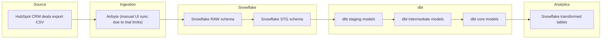

```mermaid
flowchart LR
  subgraph Source
    hubspot["HubSpot CRM deals export CSV"]
  end

  subgraph Ingestion
    airbyte["Airbyte (manual UI sync due to trial limits)"]
  end

  subgraph Snowflake
    snowflake_raw["Snowflake RAW schema"]
    snowflake_stg["Snowflake STG schema"]
  end

  subgraph dbt
    dbt_stg["dbt staging models"]
    dbt_int["dbt intermediate models"]
    dbt_core["dbt core models"]
  end

  subgraph Analytics
    snowflake_analytics["Snowflake transformed tables"]
  end

  hubspot --> airbyte --> snowflake_raw --> snowflake_stg
  snowflake_stg --> dbt_stg --> dbt_int --> dbt_core --> snowflake_analytics
```
