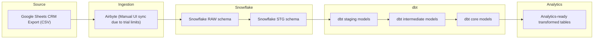

```mermaid
flowchart LR

  subgraph Source
    gs["Google Sheets CRM Export (CSV)"]
  end

  subgraph Ingestion
    airbyte["Airbyte (Manual UI sync due to trial limits)"]
  end

  subgraph Snowflake
    raw["Snowflake RAW schema"]
    stg["Snowflake STG schema"]
  end

  subgraph dbt
    dbt_stg["dbt staging models"]
    dbt_int["dbt intermediate models"]
    dbt_core["dbt core models"]
  end

  subgraph Analytics
    analytics["Analytics-ready transformed tables"]
  end

  %% arrow flow outside subgraph blocks so titles stay clean
  gs --> airbyte
  airbyte --> raw
  raw --> stg
  stg --> dbt_stg
  dbt_stg --> dbt_int
  dbt_int --> dbt_core
  dbt_core --> analytics
```
