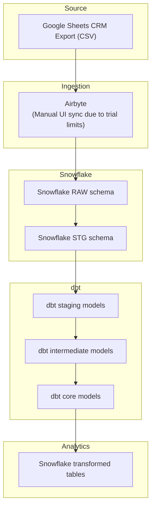

```mermaid
flowchart TB
  subgraph Source
    gs["Google Sheets CRM Export (CSV)"]
  end

  subgraph Ingestion
    airbyte["Airbyte\n(Manual UI sync due to trial limits)"]
  end

  subgraph Snowflake
    raw["Snowflake RAW schema"]
    stg["Snowflake STG schema"]
  end

  subgraph dbt
    dbt_stg["dbt staging models"]
    dbt_int["dbt intermediate models"]
    dbt_core["dbt core models"]
  end

  subgraph Analytics
    analytics["Snowflake transformed tables"]
  end

  gs --> airbyte --> raw --> stg --> dbt_stg --> dbt_int --> dbt_core --> analytics
```
